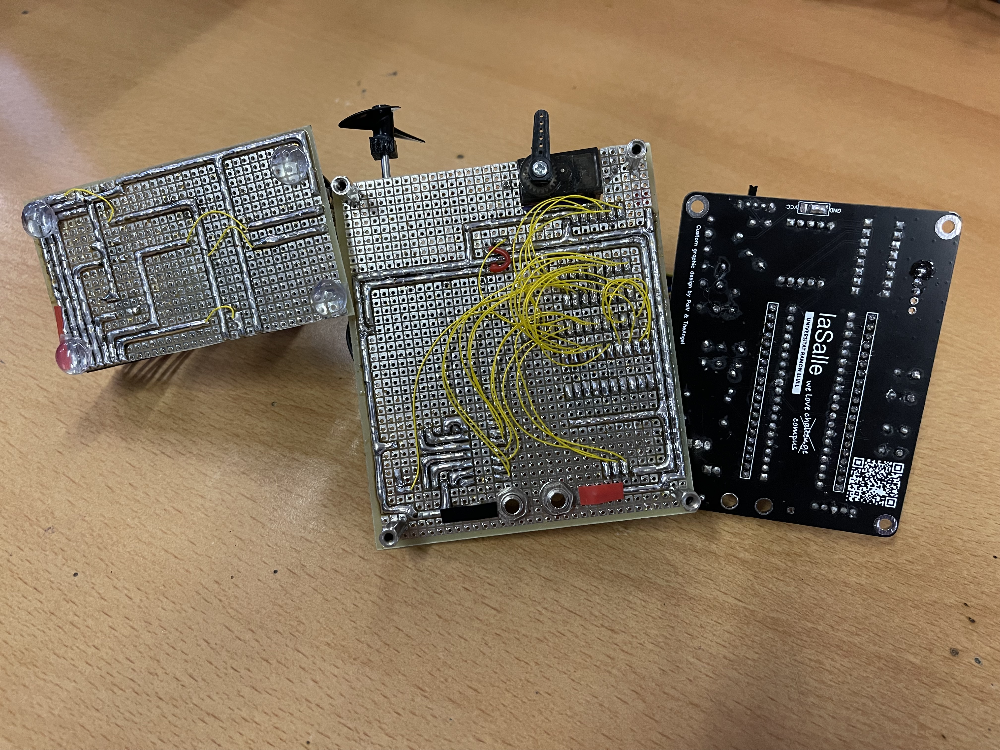

# Assembler - LSControlTower F1
Project named "LSControlTower", part of the "Digital Systems & Microprocessors" subject. 

Simulates the controls of a ship that has been built using a PIC18 micro, servo, motor, LED indicators, push buttons and a joystick.

Some of the functionalities of the ship include: 

-Real time throttle and direction control, outputing PWM system to control the motor and servo. Current speed and direction values are displayed on LED displays

-Recording of several values of direction and speed, in order to be able to replicate them later with exactly the same time spacing between each recorded direction and speed value. 

Demo video: https://youtu.be/4yO8Ve91BX4

# Authors
[Pol Valero] (https://github.com/pol-valero) - Implemented all electronic boards. Helped with assembly code. 

[Angel Garcia] (https://github.com/TheAngel11) - Implemented assembly code. Helped with electronic boards. 
